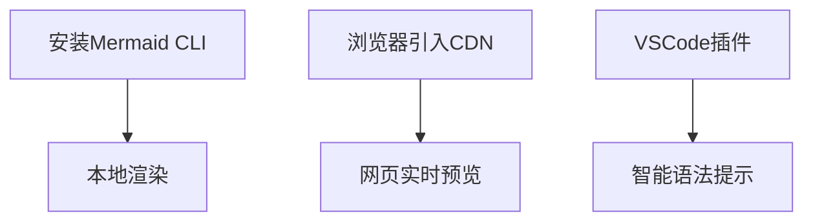
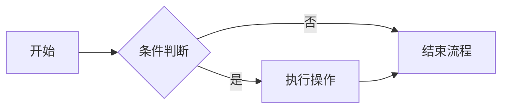
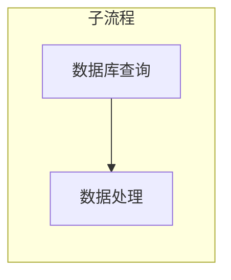
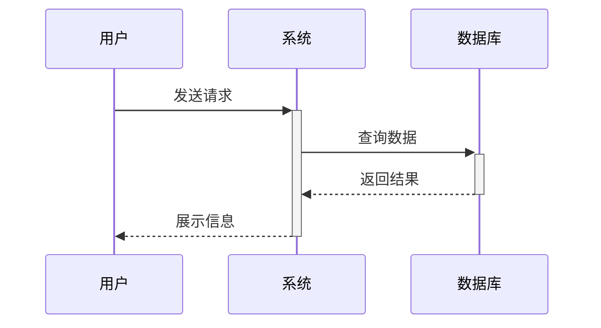
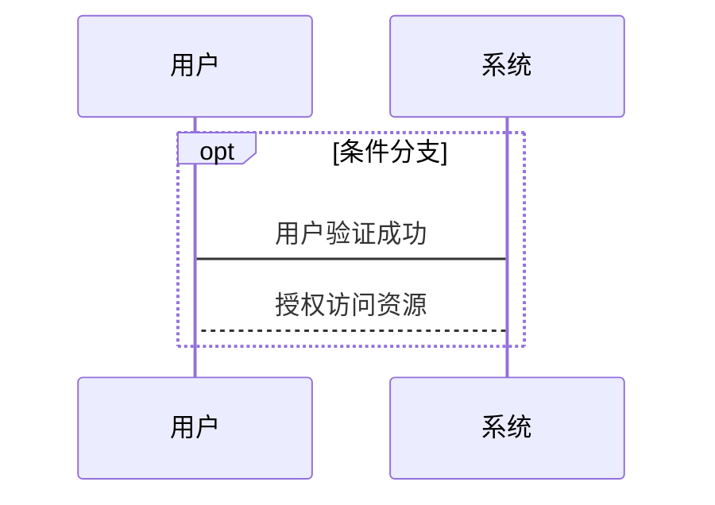
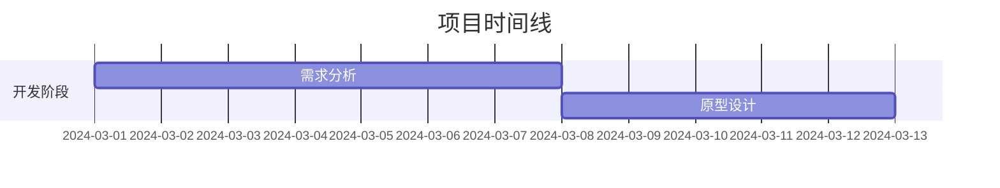
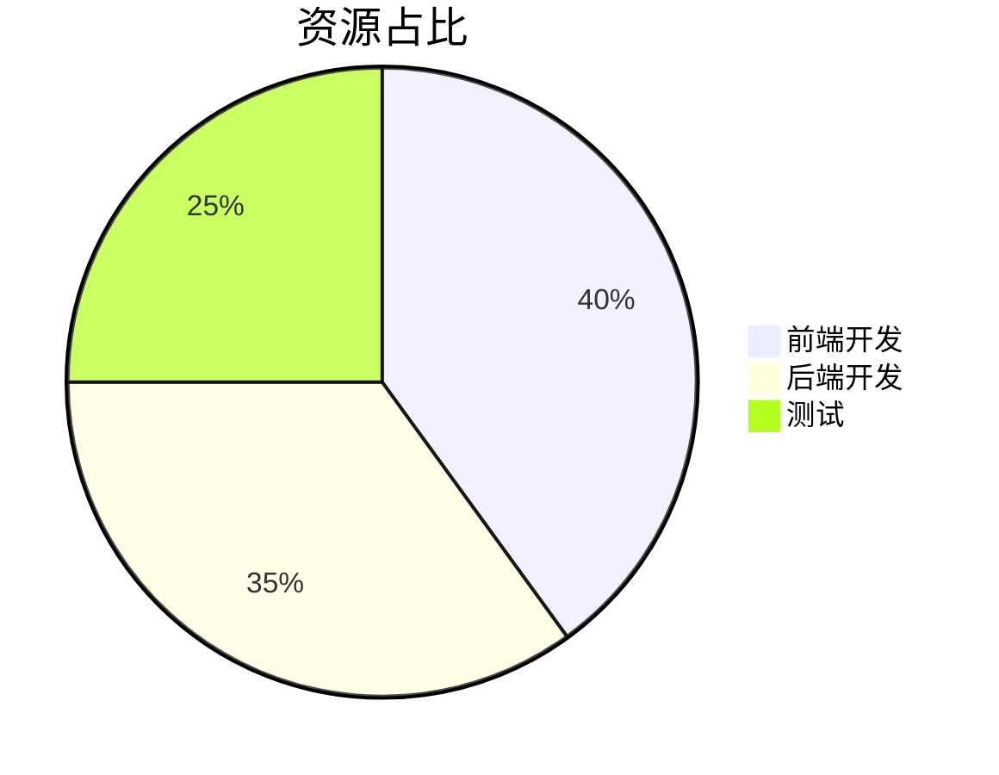
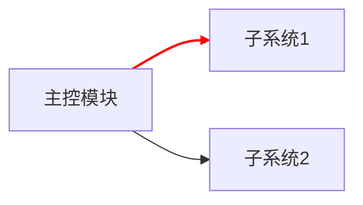

# Mermaid 教程：用文本绘制专业级流程图与图表  
> **"代码即图表" 的沉浸式可视化方案**  

---

## 📌 核心优势  
- **纯文本驱动**：无需图形工具，用代码定义图表  
- **无缝集成**：原生支持 Markdown，GitHub/GitLab/Typora 全兼容  
- **动态更新**：修改数据自动重绘，维护成本降低 80%  
- **多范式支持**：流程图 / 时序图 / 甘特图 / 饼图 / 用户旅程图  

---

## 🧰 环境准备  
### 三秒上手方案  


### 开发者工具链  
| 工具类型 | 推荐方案 | 特色功能 |
|---------|----------|----------|
| 编辑器 | Typora / Obsidian | 内置实时渲染 |
| IDE插件 | VS Code Mermaid插件 | 语法校验+自动补全 |
| 在线工具 | [Mermaid Live Editor](https://mermaid.live) | 即时调试+导出PNG/SVG |

---

## 📘 基础语法速成  

### 1. 流程图（Flowchart）  


**进阶技巧**：  


### 2. 时序图（Sequence Diagram）  



**生命线控制**：  


### 3. 甘特图（Gantt）  


### 4. 饼图（Pie Chart）  


---

## 🛠 高级功能实战  

### 1. 自定义样式  


### 2. 多图表联动  


---

## 📊 典型应用场景  

| 场景 | 解决方案 | 优势对比 |
|------|----------|----------|
| 技术文档 | 自动生成架构图 | 版本控制友好 |
| 项目管理 | 可编程甘特图 | 数据驱动更新 |
| 教学课件 | 可交互流程演示 | 动态教学演示 |
| API设计 | 时序图可视化 | 需求沟通精准度提升 |

---

## 🚫 常见问题排查  

### 1. 图表不显示？  
- ✅ 检查代码块标记：```mermaid 而非 ```graph  
- ✅ 确认编辑器启用Mermaid支持（Typora需勾选偏好设置）  
- ✅ CDN加载失败时尝试离线模式  

### 2. 语法错误定位  
使用 [Mermaid CLI](https://github.com/mermaid-js/mermaid-cli) 进行严格校验：  
```bash
mmdc -i input.mmd -o output.svg
```

---

## 📚 持续学习路径  
1. **官方文档** [mermaid.js.org](https://mermaid.js.org)  
2. **社区资源** [Awesome Mermaid](https://github.com/mermaid-js/awesome-mermaid)  
3. **进阶课程** [Mermaid Academy](https://www.mermaid.academy/)  

> 📌 小技巧：在 VSCode 中按 `Ctrl+Shift+P` 输入 "Mermaid: Preview" 可快速调试  

---  
**立即实践**：将本教程中的示例代码粘贴到 [Mermaid Live Editor](https://mermaid.live) 即刻生成你的第一张动态图表！  
